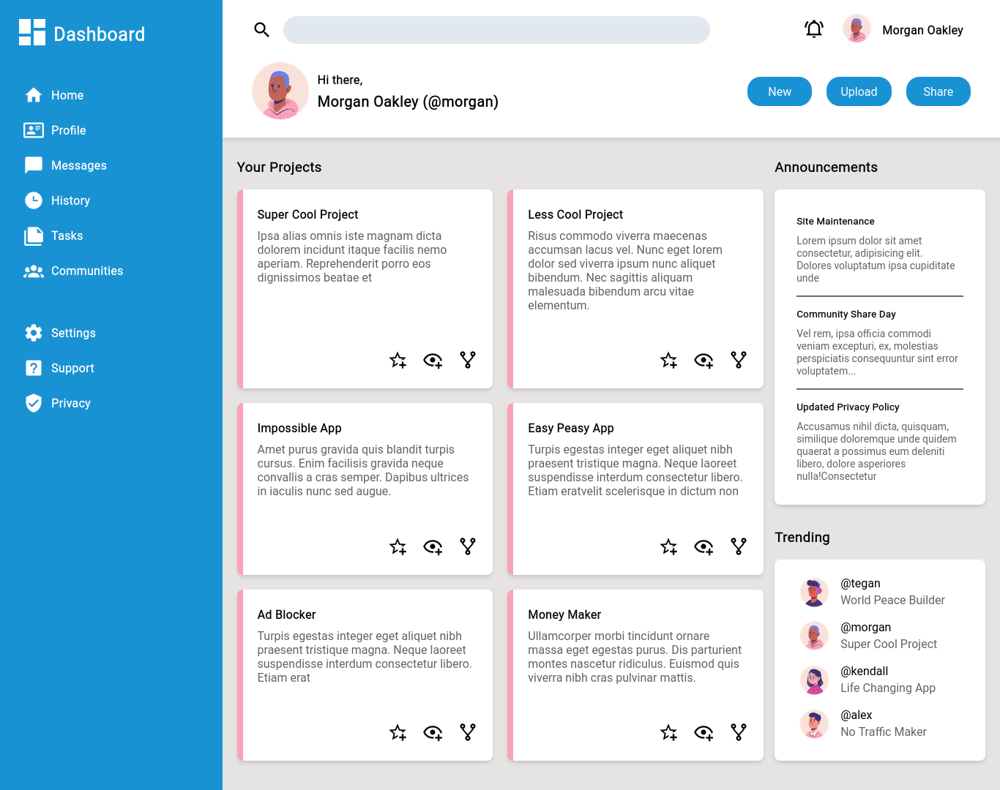

# Admin Dashboard
Combining CSS Grid and Flexbox to make a two-dimensional admin dashboard.

## Preview
Check it out by clicking [this](https://neil-justin.github.io/admin-dashboard/)

## Objectives
- Use a fractional/relative unit (instead of absolute unit e.g. px) to dynamically size the elements.
- Combine CSS Grid and Flexbox to lay things out; with CSS Grid being the primary tool and the Flexbox being the secondary.

## Acknowledgements
- This project was made possible by [The Odin Project](theodinproject.com) — a community-supported, open-source website that teaches full-stack web development for free.
- The icons used for this webpage was imported from [materialdesignicons.com](materialdesignicons.com).
- The cartoon avatars were cut out from [@pikisuperstar](https://www.freepik.com/author/pikisuperstar)'s collection of hand-drawn profile sets on [Freepik](https://www.freepik.com/collection/profile-pictures/628?query=cartoon%20avatar).